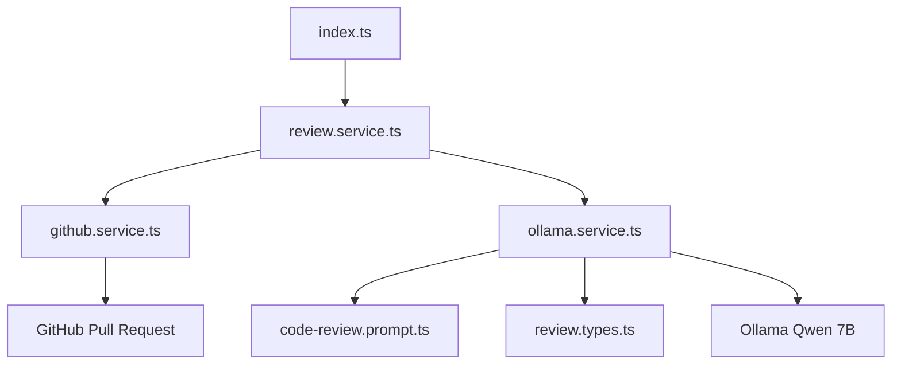

```mermaid
flowchart TD
    A[index.ts] --> B[review.service.ts]
    B --> C[github.service.ts]
    B --> D[ollama.service.ts]
    D --> E[code-review.prompt.ts]
    D --> F[review.types.ts]
    C --> G[GitHub Pull Request]
    D --> H[Ollama Qwen 7B]
```